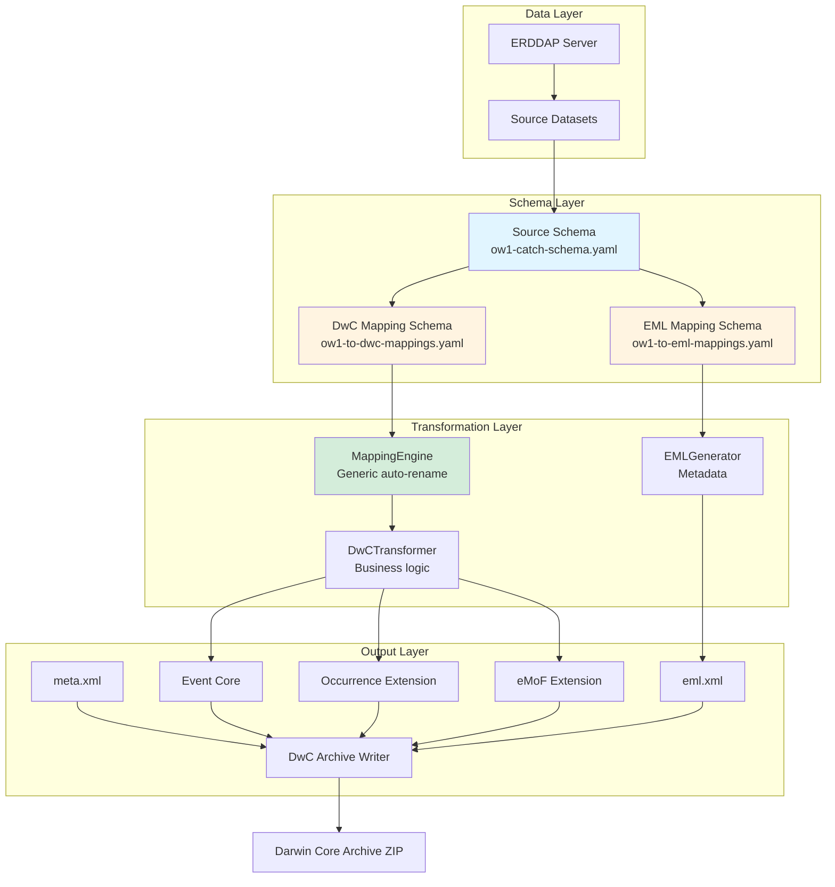
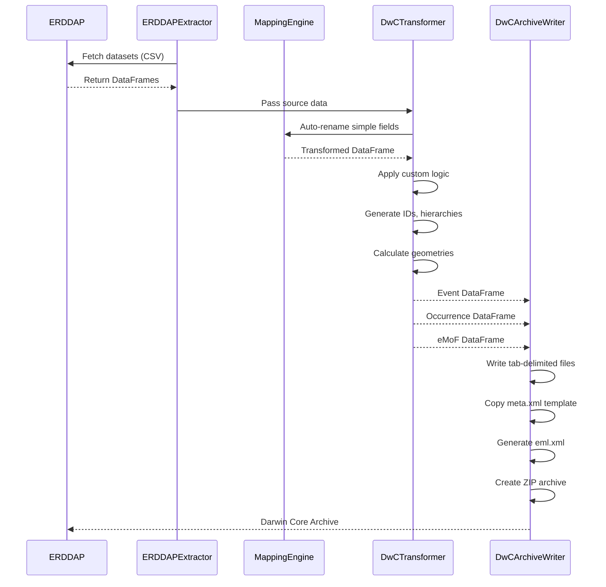

# Architecture Overview

This page describes the technical architecture of the LinkML-based transformation pipeline.

## System Architecture



## Core Components

### 1. Schema Layer (LinkML)

The foundation of the system is three LinkML YAML schemas:

#### Source Data Schema

**File**: `ow1-catch-schema.yaml`

**Purpose**: Documents the existing fisheries data structure

**Contents**:

- Class definitions for each dataset (TowRecord, CatchRecord, SpeciesCode)
- Field definitions with types, units, and descriptions
- Annotations linking to ERDDAP sources
- Dataset-level metadata (creator, publisher, funding, etc.)

**Example**:

```yaml
slots:
  total_weight:
    description: Total weight in kilograms of measured individuals
    range: float
    unit:
      ucum_code: kg
    annotations:
      erddap_source: "total_weight"
      erddap_units: "kg"
```

#### Darwin Core Mapping Schema

**File**: `ow1-to-dwc-mappings.yaml`

**Purpose**: Defines the target Darwin Core structure with mappings to source

**Contents**:

- Darwin Core class definitions (Event, Occurrence, ExtendedMeasurementOrFact)
- Field definitions with Darwin Core term URIs
- `exact_mappings` showing source → target relationships
- Comments explaining complex transformations

**Example**:

```yaml
slots:
  eventDate:
    description: The date-time during which an Event occurred
    range: string
    slot_uri: dwc:eventDate
    exact_mappings:
      - ow1_catch:time
    comments:
      - "Direct mapping from TowRecord.time"
      - "Format as ISO 8601 datetime"
```

#### EML Mapping Schema

**File**: `ow1-to-eml-mappings.yaml`

**Purpose**: Maps dataset metadata to EML structure

**Contents**:

- EML element definitions
- Mappings to source metadata fields
- Instructions for metadata transformation

### 2. Transformation Layer (Python)

#### MappingEngine (Generic)

**Purpose**: Dataset-agnostic transformation based on LinkML mappings

**Key methods**:

```python
class MappingEngine:
    def __init__(self, mapping_schema_path):
        # Load LinkML schema
        self.schema = self._load_schema()
        
    def transform_dataframe(self, source_df, target_class, strict=True):
        # Auto-rename fields based on exact_mappings
        # Only processes 1:1 mappings when strict=True
        # Handles type conversion
        return transformed_df
```

**Transformation rules**:

- Only processes fields with **exactly one** `exact_mapping`
- Performs type conversion based on LinkML `range`
- Skips fields requiring complex logic
- Issues warnings for missing required fields

**Reusability**: This engine works with **any** dataset following the same LinkML pattern.

#### DwCTransformer (Domain-Specific)

**Purpose**: Business logic for complex transformations that can't be auto-mapped

**Handles**:

- **ID generation**: Creating unique eventID, occurrenceID, measurementID
- **Hierarchical structures**: Parent-child event relationships
- **Calculated fields**: Midpoint coordinates, WKT geometries
- **Multi-source enrichment**: Joining catch data with species lookup
- **Splitting records**: Generating multiple eMoF records per catch record

**Example of custom logic**:

```python
def create_event_id(self, cruise: str, station: str) -> str:
    """Generate DwC eventID from cruise and station."""
    return f"{cruise}:{station}"

def calculate_midpoint(self, start_lat, start_lon, end_lat, end_lon):
    """Calculate geographic midpoint of tow."""
    return (start_lat + end_lat) / 2, (start_lon + end_lon) / 2
```

#### EMLGenerator

**Purpose**: Generate EML metadata from ERDDAP attributes

**Process**:

1. Fetch `NC_GLOBAL` metadata from ERDDAP info endpoint
2. Parse structured attributes (contributors, keywords)
3. Map to EML elements using schema
4. Generate valid EML 2.2.0 XML

### 3. Output Layer

#### DwCArchiveWriter

**Purpose**: Write Darwin Core Archive files and package as ZIP

**Functions**:

- Write tab-delimited text files (UTF-8)
- Copy meta.xml template
- Write EML XML
- Create ZIP archive

**File structure**:

```
ow1_dwca.zip
├── event.txt               # Tab-delimited, UTF-8
├── occurrence.txt          # Tab-delimited, UTF-8  
├── extendedmeasurementorfact.txt
├── meta.xml               # Archive descriptor
└── eml.xml                # Dataset metadata
```

## Design Patterns

### Hybrid Transformation Approach

The system uses **two complementary strategies**:

1. **Auto-rename via MappingEngine**: For simple 1:1 field mappings
2. **Custom logic via DwCTransformer**: For complex transformations

```python
# In DwCTransformer.transform_to_occurrence():

# Step 1: Auto-rename simple fields
auto_renamed = self.mapping_engine.transform_dataframe(merged, "Occurrence")

# Step 2: Custom logic for complex fields
for _, row in merged.iterrows():
    occurrence = {
        'occurrenceID': self.create_occurrence_id(...),  # Custom
        'eventID': self.create_event_id(...),            # Custom
        'basisOfRecord': 'HumanObservation',             # Static
        'scientificNameID': self.format_itis_lsid(...),  # Custom
        # ... other fields
    }

# Step 3: Merge auto-renamed with custom
result_df = pd.DataFrame(occurrences)
for col in auto_renamed.columns:
    if col not in result_df.columns:
        result_df[col] = auto_renamed[col]
```

**Rationale**: 

- Maximizes reusability (auto-rename works across datasets)
- Allows flexibility (custom logic when needed)
- Clear separation of concerns

### Strict Mapping Policy

The MappingEngine enforces **strict 1:1 mappings**:

```python
if len(exact_mappings) != 1:
    if strict:
        continue  # Skip this field
```

**Why?**

- **Unambiguous transformations**: One source field maps to exactly one target field
- **Prevents errors**: No guessing about which source field to use
- **Clear documentation**: Each mapping is explicit in the schema

**Complex cases** (multiple sources, calculations) must use custom logic in DwCTransformer.

### Template-Based Archive Structure

The `meta.xml` file is a **static template**, not generated code:

```xml
<archive xmlns="http://rs.tdwg.org/dwc/text/" metadata="eml.xml">
  <core encoding="UTF-8" fieldsTerminatedBy="\t" 
        rowType="http://rs.tdwg.org/dwc/terms/Event">
    <files>
      <location>event.txt</location>
    </files>
    <!-- field mappings -->
  </core>
  <!-- extensions -->
</archive>
```

**Benefits**:

- Easy to modify archive structure without code changes
- Can swap in different templates for different publication formats
- Clear separation between data transformation and archive packaging

## Data Flow



## Technology Stack

| Component | Technology | Purpose |
|-----------|-----------|---------|
| **Schema Definition** | LinkML YAML | Machine-readable data models |
| **Schema Validation** | LinkML Python | Runtime validation |
| **Data Extraction** | Requests + Pandas | Fetch from ERDDAP, parse CSV |
| **Transformation** | Python + Pandas | Data manipulation |
| **Metadata** | XML generation | EML 2.2.0 output |
| **Archive** | zipfile | Package as DwC-A |
| **Documentation** | MkDocs + LinkML gen-doc | Human-readable docs |

## Extensibility Points

The architecture supports several extension paths:

1. **New source formats**: Add extractors for different data sources (databases, APIs, CSV files)
2. **Additional target standards**: Create new mapping schemas (e.g., ABCD, MIDS, FAIR Data Point)
3. **Validation rules**: Add LinkML constraints and validation logic
4. **Quality control**: Insert QC steps between extraction and transformation
5. **Alternative outputs**: Generate additional formats (JSON-LD, RDF, Parquet)

Next: [Data Models](data-models.md) | [Transformation Engine](transformation-engine.md)