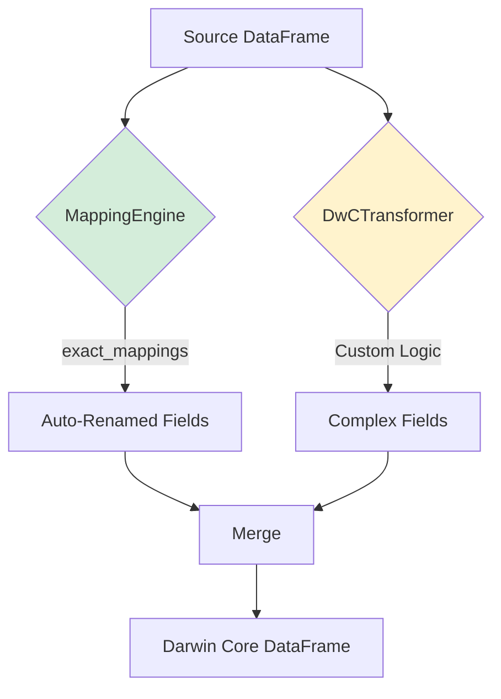

# Transformation Engine

The transformation engine is the core component that converts source data to Darwin Core format using LinkML mappings.

## Two-Stage Transformation



## Stage 1: MappingEngine (Generic)

The `MappingEngine` is a **dataset-agnostic** component that works with any LinkML mapping schema.

### Initialization

```python
class MappingEngine:
    def __init__(self, mapping_schema_path: str):
        # Load LinkML schema YAML
        self.schema = self._load_schema()
        self.classes = self.schema.get('classes', {})
        self.slots = self.schema.get('slots', {})
```

Loads and parses the mapping schema to understand:

- Which classes exist (Event, Occurrence, etc.)
- Which slots each class has
- What mappings are defined for each slot

### Core Algorithm

```python
def transform_dataframe(self, source_df, target_class, strict=True):
    mappings = self._get_slot_mappings(target_class)
    result = pd.DataFrame()
    
    for target_field, mapping_spec in mappings.items():
        exact_mappings = mapping_spec['exact_mappings']
        
        # STRICT RULE: Only process 1:1 mappings
        if len(exact_mappings) != 1:
            continue  # Skip this field
        
        # Extract source field name
        source_field = self._extract_source_field(exact_mappings[0])
        
        # Check if source field exists
        if source_field not in source_df.columns:
            continue
        
        # Copy and convert the column
        target_range = mapping_spec['range']
        result[target_field] = source_df[source_field].apply(
            lambda x: self._convert_type(x, target_range)
        )
    
    return result
```

### Processing Rules

**1. Strict 1:1 Mapping**

Only fields with **exactly one** `exact_mapping` are processed:

```yaml
# ✅ WILL be auto-transformed
vernacularName:
  exact_mappings:
    - ow1_catch:species_common_name

# ❌ WILL NOT be auto-transformed (multiple mappings)
decimalLatitude:
  related_mappings:
    - ow1_catch:latitude
    - ow1_catch:end_latitude

# ❌ WILL NOT be auto-transformed (no mappings)
occurrenceID:
  # (requires custom ID generation)
```

**2. Type Conversion**

Automatically converts based on LinkML `range`:

| LinkML Range | Python Type | Conversion |
|--------------|-------------|------------|
| `string` | `str` | `str(value)` |
| `float` | `float` | `float(value)` |
| `integer` | `int` | `int(value)` |
| `boolean` | `bool` | `bool(value)` |

**3. Field Name Extraction**

Handles prefixed mappings:

```python
def _extract_source_field(self, mapping: str) -> str:
    # "ow1_catch:species_common_name" → "species_common_name"
    if ':' in mapping:
        return mapping.split(':', 1)[1]
    return mapping
```

### Example: Occurrence Transformation

**Input mapping schema**:

```yaml
slots:
  vernacularName:
    slot_uri: dwc:vernacularName
    range: string
    exact_mappings:
      - ow1_catch:species_common_name
  
  scientificName:
    slot_uri: dwc:scientificName
    range: string
    exact_mappings:
      - ow1_catch:species_scientific_name
```

**Input DataFrame**:

| species_common_name | species_scientific_name | total_count |
|---------------------|-------------------------|-------------|
| Butterfish          | Peprilus triacanthus    | 45          |
| Summer Flounder     | Paralichthys dentatus   | 12          |

**MappingEngine output**:

| vernacularName  | scientificName           |
|-----------------|--------------------------|
| Butterfish      | Peprilus triacanthus     |
| Summer Flounder | Paralichthys dentatus    |

Note: `total_count` is not in the output because it has no `exact_mapping` in the mapping schema.

## Stage 2: DwCTransformer (Custom Logic)

The `DwCTransformer` handles transformations that cannot be auto-mapped.

### ID Generation

**Challenge**: Darwin Core requires unique identifiers that don't exist in source data.

**Solution**: Generate structured IDs from source fields:

```python
@staticmethod
def create_event_id(cruise: str, station: str) -> str:
    """Generate DwC eventID from cruise and station."""
    return f"{cruise}:{station}"
    # Example: "OW1_BT2301:C01"

@staticmethod
def create_occurrence_id(cruise: str, station: str, 
                        species: str, size_class: str = None) -> str:
    """Generate DwC occurrenceID, including size_class if present."""
    species_code = str(species).replace(' ', '_').replace('/', '_')
    base_id = f"{cruise}:{station}:{species_code}"
    if size_class and pd.notna(size_class):
        size_code = str(size_class).replace(' ', '_').upper()
        return f"{base_id}:{size_code}"
    return base_id
    # Example: "OW1_BT2301:C01:BUTTERFISH:LARGE"
```

### Hierarchical Events

**Challenge**: Create parent-child event relationships (cruise → tow).

**Solution**: Two-pass event generation:

```python
def transform_to_event(self, tow_df: pd.DataFrame) -> pd.DataFrame:
    events = []
    
    # Pass 1: Create cruise-level parent events
    cruises = tow_df.groupby('cruise').agg({
        'time': 'min'  # Use earliest tow time
    }).reset_index()
    
    for _, cruise_row in cruises.iterrows():
        cruise_event = {
            'eventID': cruise_row['cruise'],
            'parentEventID': None,  # No parent
            'eventType': 'cruise',
            'eventDate': cruise_row['time'],
            # ...
        }
        events.append(cruise_event)
    
    # Pass 2: Create tow-level child events
    for _, tow_row in tow_df.iterrows():
        tow_event = {
            'eventID': self.create_event_id(tow_row['cruise'], tow_row['station']),
            'parentEventID': tow_row['cruise'],  # Links to parent
            'eventType': 'tow',
            'eventDate': tow_row['time'],
            # ...
        }
        events.append(tow_event)
    
    return pd.DataFrame(events)
```

### Calculated Fields

**Challenge**: Create fields from multiple sources or calculations.

#### Geographic Midpoint

```python
@staticmethod
def calculate_midpoint(start_lat, start_lon, end_lat, end_lon):
    """Calculate geographic midpoint of tow."""
    return (start_lat + end_lat) / 2, (start_lon + end_lon) / 2

# Usage in transform_to_event():
mid_lat, mid_lon = self.calculate_midpoint(
    row['latitude'], row['longitude'],
    row['end_latitude'], row['end_longitude']
)
```

#### WKT Geometries

```python
# Create LINESTRING for tow track
footprint_wkt = (
    f"LINESTRING ("
    f"{row['longitude']} {row['latitude']}, "
    f"{row['end_longitude']} {row['end_latitude']}"
    f")"
)
```

### Multi-Source Enrichment

**Challenge**: Join catch data with species lookup to get taxonomic info.

**Solution**: DataFrame merge + field extraction:

```python
def transform_to_occurrence(self, catch_df, species_df):
    # Join on species_common_name
    merged = catch_df.merge(
        species_df,
        on='species_common_name',
        how='left'
    )
    
    # Now merged has both catch data AND taxonomic data
    for _, row in merged.iterrows():
        occurrence = {
            'scientificName': row['species_scientific_name'],  # From species_df
            'scientificNameID': self.format_itis_lsid(row['ITIS_tsn']),  # From species_df
            'vernacularName': row['species_common_name'],  # From catch_df
            'individualCount': row['total_count'],  # From catch_df
            # ...
        }
```

### Record Expansion (1:Many)

**Challenge**: Generate multiple eMoF records from single catch record.

**Solution**: Loop and append:

```python
def transform_to_emof(self, catch_df):
    emof_records = []
    
    for _, row in catch_df.iterrows():
        occurrence_id = self.create_occurrence_id(...)
        
        # Generate multiple measurement records from one catch record:
        
        # 1. Size class (if present)
        if pd.notna(row.get('size_class')):
            emof_records.append({
                'measurementType': 'size class',
                'measurementValue': row['size_class'],
                # ...
            })
        
        # 2. Total weight
        if pd.notna(row.get('total_weight')):
            emof_records.append({
                'measurementType': 'total biomass',
                'measurementValue': row['total_weight'],
                'measurementUnit': 'kg',
                # ...
            })
        
        # 3. Total count
        # 4. Mean length
        # 5. Std dev length
        # (similar pattern)
    
    return pd.DataFrame(emof_records)
```

**Result**: One catch record → up to 5 eMoF records.

## Hybrid Integration

The two stages work together:

```python
# In DwCTransformer.transform_to_occurrence():

# Step 1: Auto-rename via MappingEngine
if self.mapping_engine:
    auto_renamed = self.mapping_engine.transform_dataframe(
        merged, 
        "Occurrence"
    )

# Step 2: Custom logic for complex fields
occurrences = []
for _, row in merged.iterrows():
    occurrence = {
        'occurrenceID': self.create_occurrence_id(...),  # Custom
        'eventID': self.create_event_id(...),            # Custom
        'basisOfRecord': 'HumanObservation',             # Static
        'scientificNameID': self.format_itis_lsid(...),  # Custom
        # ...
    }
    occurrences.append(occurrence)

result_df = pd.DataFrame(occurrences)

# Step 3: Merge - custom fields take precedence
for col in auto_renamed.columns:
    if col not in result_df.columns:
        result_df[col] = auto_renamed[col]

return result_df
```

## Design Principles

### Separation of Concerns

- **MappingEngine**: Simple, reusable field renaming
- **DwCTransformer**: Domain-specific business logic

### Explicit > Implicit

- Complex transformations require explicit code
- No "magic" - transformations are traceable
- Mappings document what happens, code implements how

### Fail-Safe Defaults

```python
# MappingEngine skips unknown fields rather than erroring
if source_field not in source_df.columns:
    if mapping_spec['required']:
        warnings.warn(f"Required field missing: {source_field}")
    continue  # Skip, don't crash

# DwCTransformer checks for null values
if pd.isna(row.get('size_class')):
    # Don't create size_class eMoF record
    pass
```

### Type Safety

```python
# Always convert types explicitly
'individualCount': int(row['total_count']) if pd.notna(row['total_count']) else None

# Round coordinates to appropriate precision
'decimalLatitude': round(mid_lat, 6)
```

## Reusability

The MappingEngine works with **any** data following the LinkML pattern:

```python
# Works for OW1 data
engine = MappingEngine('ow1-to-dwc-mappings.yaml')
event_df = engine.transform_dataframe(tow_data, 'Event')

# Works for different survey with same pattern
engine2 = MappingEngine('other-survey-to-dwc-mappings.yaml')
event_df2 = engine2.transform_dataframe(other_survey_data, 'Event')
```

**Requirements**:

1. Source data documented in LinkML schema
2. Mapping schema with `exact_mappings`
3. Custom transformer for complex logic (if needed)

## Performance Considerations

For large datasets:

- **Vectorized operations** where possible (pandas apply)
- **Batch processing** for ID generation
- **Lazy evaluation** - only transform needed fields
- **Memory-efficient** - no unnecessary copies

## Next Steps

- [View Complete Workflow](../workflow.md)
- [Explore Reusability Guide](../reusability.md)
- [See Example Outputs](../outputs.md)