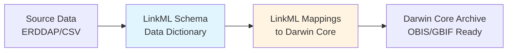

# Standardizing Fisheries Data with LinkML

## A Better Way to Mobilize Marine Survey Data

Fisheries stock assessment surveys generate valuable biodiversity data, but this information often remains isolated in agency-specific formats. This project demonstrates how **LinkML (Linked Data Modeling Language)** can bridge the gap between domain-specific fisheries data and internationally recognized biodiversity standards like Darwin Core.

## The Challenge

Traditional fisheries trawl surveys face several data mobilization challenges:

- **No standard data model**: Each agency or program uses different field names, units, and structures
- **Poor documentation**: Data dictionaries are often incomplete or missing entirely  
- **Manual transformation**: Converting to Darwin Core requires significant custom coding for each dataset
- **Lost provenance**: It's difficult to trace where each published field came from in the source data
- **Limited reusability**: Transformation code written for one survey doesn't work for others

## The Solution: LinkML as a Bridge

This project shows how LinkML solves these problems by creating **explicit, machine-readable mappings** between source data and target standards:

**Key advantages:**

- **Transparency**: Every mapping is documented and traceable
- **Reusability**: The same transformation engine works across different surveys
- **Validation**: LinkML ensures data meets both source and target requirements
- **Maintainability**: Changes to mappings don't require rewriting code
- **Interoperability**: LinkML schemas can map to multiple standards (Darwin Core, EML, FAIR Data Point, etc.)

## What This Documentation Covers

This site demonstrates a complete workflow using data from the **Rutgers OW1 Bottom Trawl Survey**:

1. **Source Data Modeling**: Documenting existing fisheries data structure in LinkML
2. **Semantic Mappings**: Defining relationships between source fields and Darwin Core terms
3. **Automated Transformation**: Using a generic engine that reads LinkML mappings and applies transformations
4. **Standards Compliance**: Producing valid Darwin Core Archives ready for OBIS publication

## Why This Matters for Marine Science

Making fisheries data interoperable with biodiversity repositories:

- **Increases data discoverability**: Fisheries observations become findable alongside other marine biodiversity data
- **Enables synthesis**: Researchers can combine fisheries surveys with other data sources for large-scale analyses
- **Preserves knowledge**: Explicit documentation prevents loss of institutional knowledge
- **Supports management**: Better data access improves evidence-based fisheries and conservation decisions

## Quick Links

- [View the Complete Workflow](workflow.md)
- [Explore the Architecture](architecture/overview.md)
- [See Schema Documentation](schemas/source-data.md)
- [Learn About Reusability](reusability.md)

## Project Context

This work is part of research funded by the **Ocean Wind 1 (OW1) offshore wind monitoring program**, conducted by Rutgers University Marine Field Station. The goal is to establish best practices for mobilizing fisheries survey data to support both offshore wind impact assessment and broader marine biodiversity research.

---

**Ready to dive in?** Start with the [Workflow Overview](workflow.md) to see how the system works end-to-end.