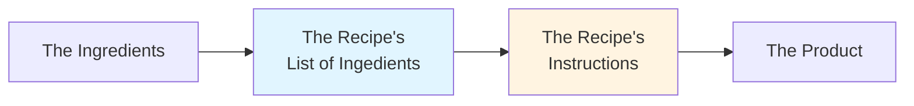
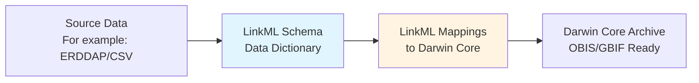

# Standardizing Fisheries Data with LinkML

## A Better Way to Mobilize Marine Survey Data

Fisheries stock assessment surveys generate valuable biodiversity data, but this information often remains difficult to access and reuse, in part becuase of reliance on closed (i.e. internal to the organization), or poorly documented standards. This project demonstrates how **LinkML (Linked Data Modeling Language)** provides a reusable framework can bridge the gap between domain-specific fisheries data and the internationally used biodiversity standard, Darwin Core.

## A Solution: LinkML as a Bridge

The data modeling language LinkML can mitigate these challenges by creating **explicit, machine-readable mappings** between source data and target standards:

**Key advantages:**

- **Transparency**: Every mapping is _documented and traceable_
- **Reusability**: The same transformation engine _works across different surveys_
- **Validation**: _Automated QC_ as part of the standardization process.
- **Maintainability**: The model and the code can evolve independently.
- **Interoperability**: LinkML schemas can map to multiple standards (e.g. Darwin Core, EML)

## How will this improve your science?

- **Increases data discoverability**: Standardized data is easy to share and easy to find. Your data become findable alongside other marine biodiversity data
- **Enables synthesis**: Regional interests can be more quickly assessed when researchers can combine fisheries surveys with other data sources for large-scale analyses.
- **Preserves knowledge**: Explicit documentation prevents loss of institutional knowledge, and provides a clear starting point for new staff.

## Quick Links

- [View the Complete Workflow](workflow.md)
- [Explore the Architecture](architecture/overview.md)
- [See Schema Documentation](schemas/source-data.md)
- [Learn About Reusability](reusability.md)