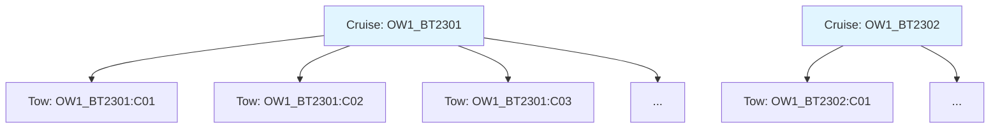
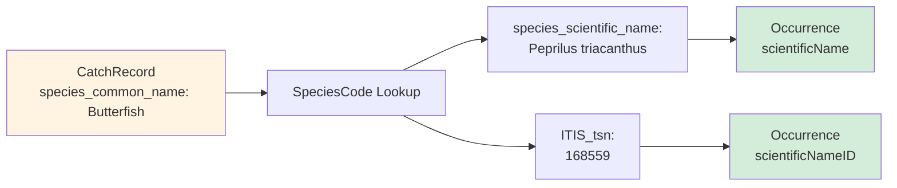

# Darwin Core Archive Outputs

This page describes the output files generated by the transformation pipeline.

## Archive Structure

The pipeline produces a Darwin Core Archive (DwC-A) as a ZIP file containing five components:

```
ow1_dwca.zip
├── event.txt                           # Event core (82 records)
├── occurrence.txt                      # Occurrence extension (1,181 records)
├── extendedmeasurementorfact.txt      # eMoF extension (5,623 records)
├── meta.xml                            # Archive structure descriptor
└── eml.xml                             # Dataset metadata (EML 2.2.0)
```

**Location in repository**: `models/datasets/rutgers/ow1_dwca/` (unzipped) and `models/datasets/rutgers/ow1_dwca.zip`

## File Formats

All data files use:

- **Encoding**: UTF-8
- **Delimiter**: Tab (`\t`)
- **Line terminator**: Newline (`\n`)
- **Headers**: Column names in first row

## Event Core (event.txt)

Contains sampling event records with a two-level hierarchy.

### Structure

**82 total records**:

- 2 cruise-level parent events
- 80 tow-level child events

### Record Types

#### Cruise Events (Parents)

```
eventID: OW1_BT2301
parentEventID: [empty]
eventType: cruise
eventDate: 2023-01-15T10:30:00Z
decimalLatitude: [empty]
decimalLongitude: [empty]
...
```

**Purpose**: Group all tows from a single survey cruise

#### Tow Events (Children)

```
eventID: OW1_BT2301:C01
parentEventID: OW1_BT2301
eventType: tow
eventDate: 2023-01-15T14:22:00Z
decimalLatitude: 39.5123
decimalLongitude: -74.2045
footprintWKT: LINESTRING(-74.2 39.5, -74.18 39.52)
samplingProtocol: Bottom otter trawl
samplingEffort: 20 minutes at 3 knots (~1 nautical mile)
...
```

**Purpose**: Represent individual trawl tows where species were collected

### Key Fields

| Darwin Core Term | Description | Example Value |
|------------------|-------------|---------------|
| eventID | Unique identifier | `OW1_BT2301:C01` |
| parentEventID | Links to parent cruise | `OW1_BT2301` |
| eventType | Type of event | `cruise` or `tow` |
| eventDate | ISO 8601 datetime | `2023-01-15T14:22:00Z` |
| locationID | Station identifier | `C01` |
| decimalLatitude | Midpoint latitude | `39.5123` |
| decimalLongitude | Midpoint longitude | `-74.2045` |
| footprintWKT | Tow track geometry | `LINESTRING(...)` |
| geodeticDatum | Coordinate system | `EPSG:4326` |
| minimumDepthInMeters | Min tow depth | `15.2` |
| maximumDepthInMeters | Max tow depth | `18.7` |
| samplingProtocol | Method used | `Bottom otter trawl` |
| sampleSizeValue | Tow duration | `20` |
| sampleSizeUnit | Duration units | `minutes` |

### Hierarchical Relationships



## Occurrence Extension (occurrence.txt)

Contains species observation records, one per species (or species + size class) caught in each tow.

### Structure

**1,181 total records**

Each record represents:

- A single species caught in a single tow, OR
- A single species + size class combination caught in a single tow

### Example Record

```
occurrenceID: OW1_BT2301:C01:BUTTERFISH:LARGE
eventID: OW1_BT2301:C01
basisOfRecord: HumanObservation
occurrenceStatus: present
vernacularName: Butterfish
scientificName: Peprilus triacanthus
scientificNameID: urn:lsid:itis.gov:itis_tsn:168559
taxonRank: species
kingdom: Animalia
individualCount: 45
occurrenceRemarks: Size class: LARGE
```

### Key Fields

| Darwin Core Term | Description | Source | Example |
|------------------|-------------|--------|---------|
| occurrenceID | Unique identifier | Generated | `OW1_BT2301:C01:BUTTERFISH:LARGE` |
| eventID | Links to tow event | Generated | `OW1_BT2301:C01` |
| basisOfRecord | Record type | Static | `HumanObservation` |
| occurrenceStatus | Presence/absence | Static | `present` |
| vernacularName | Common name | CatchRecord | `Butterfish` |
| scientificName | Scientific name | SpeciesCode lookup | `Peprilus triacanthus` |
| scientificNameID | ITIS LSID | SpeciesCode lookup | `urn:lsid:itis.gov:itis_tsn:168559` |
| taxonRank | Taxonomic level | Static | `species` |
| kingdom | Taxonomic kingdom | Static | `Animalia` |
| individualCount | Number caught | CatchRecord | `45` |
| occurrenceRemarks | Additional notes | Generated | `Size class: LARGE` |

### Taxonomic Enrichment

Occurrence records are enriched via the species lookup table:



## Extended Measurement or Fact (extendedmeasurementorfact.txt)

Contains measurement records associated with occurrences.

### Structure

**5,623 total records**

Approximately 5 measurement records per occurrence:

1. Size class (categorical, if present)
2. Total biomass (weight in kg)
3. Abundance (count of individuals)
4. Mean length (mm)
5. Length standard deviation (mm)

### Example Records

#### Size Class Measurement

```
measurementID: OW1_BT2301:C01:BUTTERFISH:LARGE_size_class
occurrenceID: OW1_BT2301:C01:BUTTERFISH:LARGE
eventID: OW1_BT2301:C01
measurementType: size class
measurementValue: LARGE
measurementUnit: [empty]
measurementMethod: Visual assessment during sorting
measurementRemarks: Categorical size class designation
```

#### Biomass Measurement

```
measurementID: OW1_BT2301:C01:BUTTERFISH:LARGE_weight
occurrenceID: OW1_BT2301:C01:BUTTERFISH:LARGE
eventID: OW1_BT2301:C01
measurementType: total biomass
measurementValue: 8.75
measurementUnit: kg
measurementTypeID: http://vocab.nerc.ac.uk/collection/P01/current/OWETXX01/
measurementMethod: Bottom otter trawl
```

#### Length Measurement

```
measurementID: OW1_BT2301:C01:BUTTERFISH:LARGE_mean_length
occurrenceID: OW1_BT2301:C01:BUTTERFISH:LARGE
eventID: OW1_BT2301:C01
measurementType: mean FL length
measurementValue: 185.3
measurementUnit: mm
measurementTypeID: http://vocab.nerc.ac.uk/collection/P01/current/FL01XX01/
measurementMethod: Caliper measurement
measurementRemarks: Length type: FL
```

### Key Fields

| Darwin Core Term | Description | Example |
|------------------|-------------|---------|
| measurementID | Unique identifier | `OW1_BT2301:C01:BUTTERFISH_weight` |
| occurrenceID | Links to occurrence | `OW1_BT2301:C01:BUTTERFISH` |
| eventID | Links to event | `OW1_BT2301:C01` |
| measurementType | What was measured | `total biomass`, `mean FL length` |
| measurementValue | Numeric or categorical value | `8.75`, `LARGE` |
| measurementUnit | Units of measurement | `kg`, `mm`, `individuals` |
| measurementTypeID | Controlled vocabulary URI | BODC P01 or NERC codes |
| measurementMethod | How measured | `Bottom otter trawl`, `Caliper` |
| measurementRemarks | Additional context | `Length type: FL` |

### Measurement Types

| Type | measurementType | measurementUnit | Count |
|------|-----------------|-----------------|-------|
| Size class | `size class` | [empty] | ~400 |
| Biomass | `total biomass` | `kg` | 1,181 |
| Abundance | `abundance` | `individuals` | 1,181 |
| Mean length | `mean {type} length` | `mm` | ~1,000 |
| Std length | `std dev {type} length` | `mm` | ~1,000 |

## Archive Descriptor (meta.xml)

Defines the structure and relationships between files in the archive.

### Purpose

- Maps file columns to Darwin Core terms
- Specifies core vs. extensions
- Defines file encoding and delimiters
- Documents foreign key relationships

### Structure

```xml
<archive metadata="eml.xml">
  <core rowType="http://rs.tdwg.org/dwc/terms/Event">
    <files><location>event.txt</location></files>
    <id index="0"/>
    <field index="0" term="http://rs.tdwg.org/dwc/terms/eventID"/>
    <field index="1" term="http://rs.tdwg.org/dwc/terms/parentEventID"/>
    <!-- ... more fields ... -->
  </core>
  
  <extension rowType="http://rs.tdwg.org/dwc/terms/Occurrence">
    <files><location>occurrence.txt</location></files>
    <coreid index="0"/>  <!-- Links to Event via eventID -->
    <!-- ... fields ... -->
  </extension>
  
  <extension rowType="http://rs.iobis.org/obis/terms/ExtendedMeasurementOrFact">
    <files><location>extendedmeasurementorfact.txt</location></files>
    <coreid index="0"/>  <!-- Links to Event via eventID -->
    <!-- ... fields ... -->
  </extension>
</archive>
```

**Location in repository**: `models/datasets/rutgers/meta.xml` (template)

## EML Metadata (eml.xml)

Contains dataset-level metadata in Ecological Metadata Language format.

### Contents

- **Dataset description**: Title, abstract, purpose
- **People & organizations**: Creators, contacts, publishers
- **Project information**: Funding, participants, objectives
- **Coverage**: Geographic, temporal, taxonomic scope
- **Methods**: Sampling protocols, QA/QC procedures
- **Keywords**: Thematic descriptors
- **Intellectual rights**: License and usage terms

### Structure

```xml
<eml:eml packageId="bottom_trawl_survey_ow1_catch">
  <dataset>
    <title>Rutgers OW1 Bottom Trawl Survey - Catch Data</title>
    <creator>...</creator>
    <contact>...</contact>
    <publisher>...</publisher>
    <project>
      <title>Ocean Wind 1 Fisheries Monitoring</title>
      <funding>...</funding>
      <personnel>...</personnel>
    </project>
    <abstract>...</abstract>
    <methods>...</methods>
    <coverage>...</coverage>
  </dataset>
</eml:eml>
```

**Generated from**: ERDDAP `NC_GLOBAL` attributes via `EMLGenerator`

## Record Count Summary

| Component | Records | Notes |
|-----------|---------|-------|
| **Source Data** | | |
| Tows | 80 | Individual trawl events |
| Catch records | 1,181 | Species per tow |
| Species codes | 200+ | Lookup table |
| **Darwin Core Output** | | |
| Events | 82 | 2 cruises + 80 tows |
| Occurrences | 1,181 | One per catch record |
| eMoF | 5,623 | ~5 measurements per occurrence |

## File Sizes

Typical file sizes for this dataset:

| File | Size | Rows |
|------|------|------|
| event.txt | ~15 KB | 82 |
| occurrence.txt | ~120 KB | 1,181 |
| extendedmeasurementorfact.txt | ~850 KB | 5,623 |
| meta.xml | ~4 KB | - |
| eml.xml | ~8 KB | - |
| **ow1_dwca.zip** | **~180 KB** | - |

## Validation

The archive can be validated using:

- **GBIF Data Validator**: https://www.gbif.org/tools/data-validator
- **IPT validation**: When uploading to an Integrated Publishing Toolkit instance
- **OBIS QC tools**: https://obis.org/manual/dataformat/

## Next Steps

- [Learn about the Workflow](workflow.md)
- [Explore the Architecture](architecture/overview.md)
- [Adapt for Your Data](reusability.md)