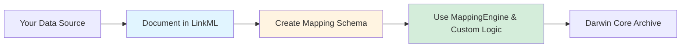

# Reusability Guide

This guide explains how to adapt the LinkML-based transformation approach for your own fisheries surveys or marine biodiversity datasets.

## The Reusable Pattern



## Step 1: Document Your Source Data

Create a LinkML schema describing your existing data structure.

### Example: Different Trawl Survey

Suppose you have a survey with these fields:

| Field Name | Type | Description |
|------------|------|-------------|
| SURVEY_ID | string | Survey identifier |
| HAUL_ID | int | Haul number |
| DATETIME | datetime | Haul start time |
| LAT_DD | float | Latitude (decimal degrees) |
| LON_DD | float | Longitude (decimal degrees) |
| COMMON_NAME | string | Species common name |
| CATCH_WT_KG | float | Catch weight |
| NUM_FISH | int | Number of individuals |

### Create Your Source Schema

**File**: `models/datasets/your_survey/your-survey-schema.yaml`

```yaml

id: https://example.org/your-survey
name: your-survey
title: Your Survey Data Model
description: Bottom trawl survey data from your institution

default_prefix: your_survey
default_range: string

imports:
  - linkml:types

classes:
  HaulRecord:
    description: A single trawl haul event
    slots:
      - survey_id
      - haul_id
      - datetime
      - lat_dd
      - lon_dd
      
  CatchRecord:
    description: Species catch data from a haul
    slots:
      - survey_id
      - haul_id
      - common_name
      - catch_wt_kg
      - num_fish

slots:
  survey_id:
    description: Survey identifier
    range: string
    required: true
    slot_uri: your_survey:survey_id
  
  haul_id:
    description: Haul number
    range: integer
    required: true
    slot_uri: your_survey:haul_id
  
  datetime:
    description: Haul start time
    range: string
    pattern: "^\\d{4}-\\d{2}-\\d{2}T\\d{2}:\\d{2}:\\d{2}Z$"
    slot_uri: your_survey:datetime
  
  lat_dd:
    description: Latitude in decimal degrees
    range: float
    unit:
      ucum_code: deg
    slot_uri: your_survey:lat_dd
  
  lon_dd:
    description: Longitude in decimal degrees
    range: float
    unit:
      ucum_code: deg
    slot_uri: your_survey:lon_dd
  
  common_name:
    description: Species common name
    range: string
    slot_uri: your_survey:common_name
  
  catch_wt_kg:
    description: Catch weight in kilograms
    range: float
    unit:
      ucum_code: kg
    minimum_value: 0.0
    slot_uri: your_survey:catch_wt_kg
  
  num_fish:
    description: Number of individuals
    range: integer
    minimum_value: 0
    slot_uri: your_survey:num_fish
```

**Key elements**:

- **Classes**: Organize your data into logical groups (hauls, catch, etc.)
- **Slots**: Define each field with type, units, constraints
- **Validation**: Add `minimum_value`, `pattern`, `required` as needed
- **URIs**: Use consistent prefix for your namespace

---

## Step 2: Create Darwin Core Mapping Schema

Define how your source fields map to Darwin Core terms.

**File**: `models/datasets/your_survey/your-survey-to-dwc.yaml`

```yaml
id: https://example.org/your-survey-dwc
name: your-survey-dwc
title: Darwin Core Mappings for Your Survey

default_prefix: dwc
default_range: string

imports:
  - linkml:types

prefixes:
  dwc: http://rs.tdwg.org/dwc/terms/
  your_survey: https://example.org/your-survey/

classes:
  Event:
    description: Sampling event records
    slots:
      - eventID
      - eventDate
      - decimalLatitude
      - decimalLongitude
      
  Occurrence:
    description: Species observation records
    slots:
      - occurrenceID
      - eventID
      - vernacularName
      - individualCount

slots:
  # Event mappings
  eventDate:
    description: Date-time of the event
    slot_uri: dwc:eventDate
    exact_mappings:
      - your_survey:datetime
  
  decimalLatitude:
    description: Latitude of event location
    slot_uri: dwc:decimalLatitude
    exact_mappings:
      - your_survey:lat_dd
  
  decimalLongitude:
    description: Longitude of event location
    slot_uri: dwc:decimalLongitude
    exact_mappings:
      - your_survey:lon_dd
  
  eventID:
    description: Unique event identifier
    slot_uri: dwc:eventID
    related_mappings:
      - your_survey:survey_id
      - your_survey:haul_id
    comments:
      - "Generate as: {survey_id}:{haul_id}"
  
  # Occurrence mappings
  vernacularName:
    description: Common species name
    slot_uri: dwc:vernacularName
    exact_mappings:
      - your_survey:common_name
  
  individualCount:
    description: Number of individuals
    slot_uri: dwc:individualCount
    exact_mappings:
      - your_survey:num_fish
  
  occurrenceID:
    description: Unique occurrence identifier
    slot_uri: dwc:occurrenceID
    related_mappings:
      - your_survey:survey_id
      - your_survey:haul_id
      - your_survey:common_name
    comments:
      - "Generate as: {survey_id}:{haul_id}:{common_name}"
```

**Mapping types**:

- **exact_mappings**: 1:1 field renames (auto-transformed)
- **related_mappings**: Requires custom logic (concatenation, calculation)
- **comments**: Document transformation rules

---

## Step 3: Adapt the Transformation Code

Copy and modify the transformation pipeline for your data.

### Option A: Minimal Changes

If your data structure is similar to OW1, just update:

```python
# In your_survey_transform.py

# Update dataset IDs
DATASET_IDS = {
    'hauls': 'your_haul_dataset_id',
    'catch': 'your_catch_dataset_id',
    'species': 'your_species_lookup_id'
}

# Update mapping schema path
MAPPING_SCHEMA = "models/datasets/your_survey/your-survey-to-dwc.yaml"

# Initialize MappingEngine with your schema
mapping_engine = MappingEngine(MAPPING_SCHEMA)
```

### Option B: Custom Transformer

Create a new transformer class for your specific logic:

```python
class YourSurveyTransformer:
    """Transform your survey data to Darwin Core."""
    
    def __init__(self, mapping_engine: MappingEngine):
        self.mapping_engine = mapping_engine
    
    def transform_to_event(self, haul_df: pd.DataFrame) -> pd.DataFrame:
        """Transform haul records to Darwin Core Events."""
        
        # Use mapping engine for auto-rename
        auto_renamed = self.mapping_engine.transform_dataframe(
            haul_df, 
            "Event"
        )
        
        # Custom logic for complex fields
        events = []
        for _, row in haul_df.iterrows():
            event = {
                'eventID': f"{row['SURVEY_ID']}:{row['HAUL_ID']}",
                'eventType': 'haul',
                # ... other custom fields
            }
            events.append(event)
        
        result_df = pd.DataFrame(events)
        
        # Merge auto-renamed fields
        for col in auto_renamed.columns:
            if col not in result_df.columns:
                result_df[col] = auto_renamed[col]
        
        return result_df
```

---

## Step 4: Generate Documentation

Update the documentation generator configuration:

**In `scripts/generate_schema_docs.py`**:

```python
SCHEMAS = {
    'your-survey-schema.yaml': {
        'output': 'your-survey-source.md',
        'title': 'Your Survey Source Data',
        'type': 'source'
    },
    'your-survey-to-dwc.yaml': {
        'output': 'your-survey-dwc.md',
        'title': 'Your Survey Darwin Core Mappings',
        'type': 'mappings'
    }
}
```

Then generate docs:

```bash
python scripts/generate_schema_docs.py
```

---

## Step 5: Test and Validate

### Test Locally

```bash
# Run transformation
python models/datasets/your_survey/transform.py

# Check outputs
ls models/datasets/your_survey/dwca/

# Validate with GBIF validator
# Upload to: https://www.gbif.org/tools/data-validator
```

### Common Issues

**Problem**: MappingEngine skips fields  
**Solution**: Check that `exact_mappings` has exactly one source

**Problem**: Missing required Darwin Core fields  
**Solution**: Add custom logic in transformer for complex fields

**Problem**: Type conversion errors  
**Solution**: Verify `range` in mapping schema matches source data type

---

## Reusable Components

These components work across any dataset:

### MappingEngine (Zero Changes Needed)

```python
# Works with any LinkML mapping schema
engine = MappingEngine('path/to/mappings.yaml')
df = engine.transform_dataframe(source_df, 'TargetClass')
```

### Documentation Generator (Minimal Config)

```python
# Just update SCHEMAS dict
SCHEMAS = {'your-schema.yaml': {...}}
```

### Meta.xml Template (Reusable)

Copy `models/datasets/rutgers/meta.xml` - it's generic!

---

## What to Customize

For each new dataset, you'll need to:

1. **Source schema** (100% custom) - Document your data structure
2. **Mapping schema** (80% similar) - Map to Darwin Core (structure is reusable)
3. **Custom transformer** (50% similar) - Adapt ID generation and complex logic
4. **Documentation config** (minimal) - Update file paths

---

## Getting Help

### LinkML Resources

- **Documentation**: https://linkml.io/
- **Tutorials**: https://linkml.io/linkml/intro/tutorial.html
- **Slack**: LinkML community workspace

### Darwin Core Resources

- **Standard**: https://dwc.tdwg.org/
- **GBIF Guide**: https://www.gbif.org/darwin-core
- **OBIS Manual**: https://obis.org/manual/

### This Project

- **GitHub Issues**: https://github.com/sformel/IA_fisheries_trawl/issues
- **Email**: steve@formeldataservices.com

**Ready to start?** Begin with [Step 1: Document Your Source Data](#step-1-document-your-source-data)

**Need examples?** See the [complete OW1 implementation](https://github.com/sformel/IA_fisheries_trawl/tree/main/models/datasets/rutgers)