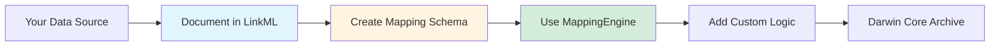

# Reusability Guide

This guide explains how to adapt the LinkML-based transformation approach for your own fisheries surveys or marine biodiversity datasets.

## The Reusable Pattern



## Step 1: Document Your Source Data

Create a LinkML schema describing your existing data structure.

### Example: Different Trawl Survey

Suppose you have a survey with these fields:

| Field Name | Type | Description |
|------------|------|-------------|
| SURVEY_ID | string | Survey identifier |
| HAUL_ID | int | Haul number |
| DATETIME | datetime | Haul start time |
| LAT_DD | float | Latitude (decimal degrees) |
| LON_DD | float | Longitude (decimal degrees) |
| COMMON_NAME | string | Species common name |
| CATCH_WT_KG | float | Catch weight |
| NUM_FISH | int | Number of individuals |

### Create Your Source Schema

**File**: `models/datasets/your_survey/your-survey-schema.yaml`

```yaml
id: https://example.org/your-survey
name: your-survey
title: Your Survey Data Model
description: Bottom trawl survey data from your institution

default_prefix: your_survey
default_range: string

imports:
  - linkml:types

classes:
  HaulRecord:
    description: A single trawl haul event
    slots:
      - survey_id
      - haul_id
      - datetime
      - lat_dd
      - lon_dd
      
  CatchRecord:
    description: Species catch data from a haul
    slots:
      - survey_id
      - haul_id
      - common_name
      - catch_wt_kg
      - num_fish

slots:
  survey_id:
    description: Survey identifier
    range: string
    required: true
    slot_uri: your_survey:survey_id
  
  haul_id:
    description: Haul number
    range: integer
    required: true
    slot_uri: your_survey:haul_id
  
  datetime:
    description: Haul start time
    range: string
    pattern: "^\\d{4}-\\d{2}-\\d{2}T\\d{2}:\\d{2}:\\d{2}Z$"
    slot_uri: your_survey:datetime
  
  lat_dd:
    description: Latitude in decimal degrees
    range: float
    unit:
      ucum_code: deg
    slot_uri: your_survey:lat_dd
  
  lon