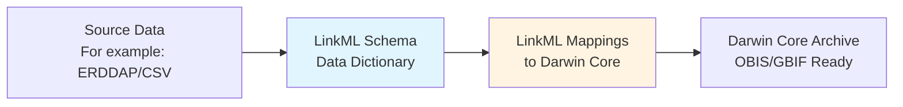

# Complete Workflow

This page walks through the entire data transformation pipeline from source fisheries data to a standards-compliant Darwin Core Archive.

## Overview Diagram



## Step-by-Step Process

### 1. Source Data: ERDDAP Datasets

<https://rowlrs-data.marine.rutgers.edu/erddap>

The workflow begins with three datasets hosted on a Rutgers ERDDAP server:

- **bottom_trawl_survey_ow1_tows**: Station/tow metadata (time, location, coordinates)
- **bottom_trawl_survey_ow1_catch**: Species catch data (weights, counts, lengths)
- **species_id_codes**: Taxonomic lookup (common names → scientific names → ITIS TSNs)

**Challenge**: These datasets use fisheries-specific terminology and structure that doesn't directly match Darwin Core.

### 2. Make LinkML Schema (AKA data model, AKA data dictionary)

Here we are describing two parts: what 'terms' do we have, and how should those terms be grouped? 

_Note: if you already have a SQL schema, there are tools to automatically turn this into LinkML._

#### What terms do we have?

Again, this is essentially a well-structured data dictionary. Terms might look like this:

```
latitude:
    description: Latitude coordinates entered at start of trawl
    range: float
    required: true
    unit:
      ucum_code: deg
    slot_uri: ow1_catch:latitude
    annotations:
      erddap_source: "latitude (start_latitude)"
      erddap_standard_name: "latitude"
      erddap_units: "degrees_north"
```

#### How should those terms be grouped? 

These are like tables in a database. We define classes, and there is nothing wrong with a term being used in multiple classes.

```yaml
classes:
  TowRecord:
    description: A single trawl tow/station event
    slots:
      - cruise
      - station
      - time
      - latitude
      - longitude
      - end_latitude
      - end_longitude
```

#### Why is this a good approach?

- Machine-readable data dictionary
- Document units and sources
- directs data validation for QC (e.g. are all dates actually dates?)

### 3. Link Mappings to Darwin Core

How does Darwin Core compare to our model? Here is an example of the Darwin Core term `eventDate`, which happens to match our trawl term, `time`, exactly. No additional context is needed.

```yaml
slots:
  eventDate:
    description: The date-time during which an Event occurred
    slot_uri: dwc:eventDate
    exact_mappings:
      - ow1_catch:time  # Shows source field
```

But what about when they don't match up exactly?  Here we began to decide what we will do. Importantly, we're capturing the information in a structured way so it can be leveraged later.

```
  decimalLongitude:
    description: >-
      The geographic longitude in decimal degrees of the geographic center of a Location.
    range: float
    slot_uri: dwc:decimalLongitude
    unit:
      ucum_code: deg
    related_mappings:
      - ow1_catch:start_longitude
      - ow1_catch:end_longitude
    comments:
      - "Calculate midpoint from TowRecord.start_longitude and TowRecord.end_longitude"
      - "Or use start_longitude as representative point"
```

### 4. Create a Darwin Core Archive: Ready for OBIS/GBIF

Here we have python code to take our LinkML instructions and create a valid Darwin Core Archive for sharing to OBIS and GBIF.

**What it handles automatically**:

_Some things we can easily reuse across data sources_

- Simple 1:1 field renames (e.g., `time` → `eventDate`)
- Type conversions (string, float, integer)
- Validation against target schema

**What requires custom logic**:

_Some things will require careful consideration of how that particular dataset works_

- Complex field generation (IDs, hierarchies)
- Calculated fields (midpoints, WKT geometries)
- Multi-source field merging

**The bottom line**

As much as possible we're using templates and generic functions to make this reusable and quickly implemented for a fisheries dataset.

####  The Darwin Core Archive Output

The pipeline produces a ZIP file containing:

```
ow1_dwca.zip
├── event.txt                           # 82 records (2 cruises + 80 tows)
├── occurrence.txt                      # 1,181 species observations
├── extendedmeasurementorfact.txt      # 5,623 measurements
├── meta.xml                            # Archive structure descriptor
└── eml.xml                             # Dataset metadata
```


#### Publication to OBIS/GBIF

The resulting archive can be:

- Uploaded directly to OBIS/GBIF Integrated Publishing Toolkit (IPT)
- Validated using GBIF Data Validator
- Published to make data globally discoverable