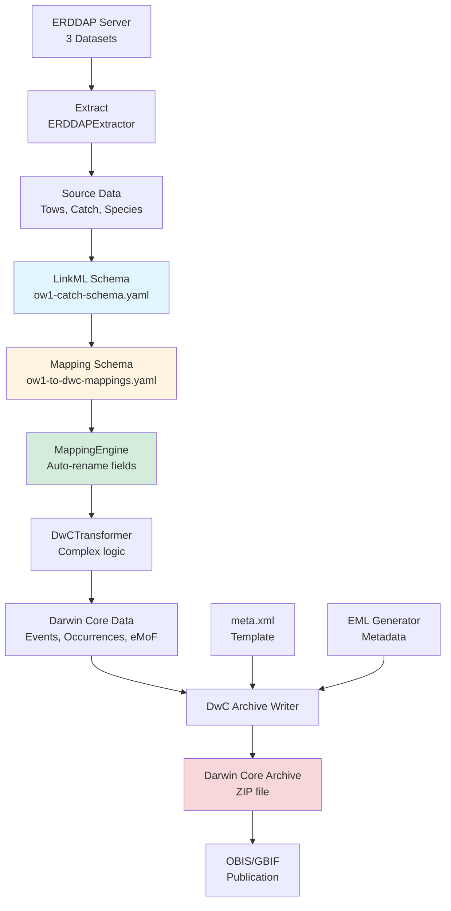
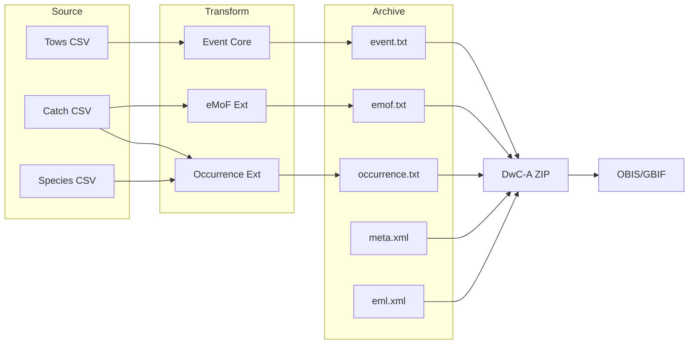

# Complete Workflow

This page walks through the entire data transformation pipeline from source fisheries data to a standards-compliant Darwin Core Archive.

## Overview Diagram



## Step-by-Step Process

### 1. Data Source: ERDDAP Datasets

The workflow begins with three datasets hosted on a Rutgers ERDDAP server:

- **bottom_trawl_survey_ow1_tows**: Station/tow metadata (time, location, coordinates)
- **bottom_trawl_survey_ow1_catch**: Species catch data (weights, counts, lengths)
- **species_id_codes**: Taxonomic lookup (common names → scientific names → ITIS TSNs)

**Challenge**: These datasets use fisheries-specific terminology and structure that doesn't directly match Darwin Core.

### 2. Source Data Modeling (LinkML)

We create `ow1-catch-schema.yaml` to formally document the source data structure:

```yaml
classes:
  TowRecord:
    description: A single trawl tow/station event
    slots:
      - cruise
      - station
      - time
      - latitude
      - longitude
      - end_latitude
      - end_longitude
```

**Benefits**:

- Machine-readable data dictionary
- Type validation and constraints
- Documents units and ERDDAP sources
- Can validate incoming data

### 3. Mapping Schema (LinkML)

The `ow1-to-dwc-mappings.yaml` schema defines the **target structure** (Darwin Core) and maps it back to source fields:

```yaml
slots:
  eventDate:
    description: The date-time during which an Event occurred
    slot_uri: dwc:eventDate
    exact_mappings:
      - ow1_catch:time  # Shows source field
```

**Key feature**: `exact_mappings` creates an explicit link between Darwin Core terms and OW1 source fields.

### 4. Generic Transformation Engine

The `MappingEngine` class reads LinkML mappings and automatically renames fields:

```python
class MappingEngine:
    def transform_dataframe(self, source_df, target_class):
        # Reads exact_mappings from schema
        # Automatically renames matching 1:1 fields
        # Handles type conversion
        return transformed_df
```

**What it handles automatically**:

- Simple 1:1 field renames (e.g., `time` → `eventDate`)
- Type conversions (string, float, integer)
- Validation against target schema

**What requires custom logic**:

- Complex field generation (IDs, hierarchies)
- Calculated fields (midpoints, WKT geometries)
- Multi-source field merging

### 5. Darwin Core Transformation

The `DwCTransformer` combines auto-renaming with custom business logic:

#### Event Core (Hierarchical)

Creates **two levels** of events:

1. **Cruise-level parents** (one per cruise)
2. **Tow-level children** (one per station/tow)

```python
# Cruise event
{
    'eventID': 'OW1_BT2301',
    'parentEventID': None,
    'eventType': 'cruise'
}

# Tow event  
{
    'eventID': 'OW1_BT2301:C01',
    'parentEventID': 'OW1_BT2301',
    'eventType': 'tow',
    'footprintWKT': 'LINESTRING(-74.2 39.5, -74.18 39.52)'
}
```

**Why hierarchical?** Allows aggregation at cruise level while preserving individual tow detail.

#### Occurrence Extension

One occurrence per species (or species + size class) caught in a tow:

- Links to tow event via `eventID`
- Enriched with taxonomic info via species lookup
- ITIS TSNs formatted as LSIDs

#### Extended Measurement or Fact (eMoF)

Measurements separated from occurrences:

- Total weight (kg)
- Total count (individuals)
- Mean length (mm)
- Length standard deviation (mm)
- Size class (categorical)

**Why eMoF?** Keeps occurrence records clean and allows multiple measurement types per observation.

### 6. Metadata Generation (EML)

The `EMLGenerator` fetches ERDDAP metadata and creates Ecological Metadata Language XML:

```python
metadata = fetch_metadata('bottom_trawl_survey_ow1_catch')
eml_xml = generate_eml_xml(metadata)
```

Maps ERDDAP `NC_GLOBAL` attributes to EML elements:

- Dataset title and abstract
- Creator/publisher info
- Project details and funding
- Methods and sampling protocols
- Keywords and coverage

### 7. Darwin Core Archive Output

The pipeline produces a ZIP file containing:

```
ow1_dwca.zip
├── event.txt                           # 82 records (2 cruises + 80 tows)
├── occurrence.txt                      # 1,181 species observations
├── extendedmeasurementorfact.txt      # 5,623 measurements
├── meta.xml                            # Archive structure descriptor
└── eml.xml                             # Dataset metadata
```

**File format**: Tab-delimited text with UTF-8 encoding

**Archive descriptor** (`meta.xml`): Defines relationships between files and maps columns to Darwin Core terms

### 8. Publication to OBIS/GBIF

The resulting archive can be:

- Uploaded directly to OBIS/GBIF Integrated Publishing Toolkit (IPT)
- Validated using GBIF Data Validator
- Published to make data globally discoverable

## Data Flow Detail



## Record Counts

From the OW1 dataset:

| Component | Records | Notes |
|-----------|---------|-------|
| **Source Data** | | |
| Tows | 80 | Individual trawl events |
| Catch records | 1,181 | Species per tow (some with size classes) |
| Species codes | 200+ | Taxonomic lookup table |
| **Darwin Core Output** | | |
| Event core | 82 | 2 cruises + 80 tows (hierarchical) |
| Occurrence extension | 1,181 | One per catch record |
| eMoF extension | 5,623 | ~5 measurements per catch record |

## Key Design Decisions

### Hierarchical Events

**Decision**: Use two-level event hierarchy (cruise → tow) rather than flat structure.

**Rationale**: 

- Allows cruise-level aggregation
- Matches survey design (cruises contain multiple tows)
- Enables cruise-level metadata (temporal coverage, participants)

### Measurements in eMoF

**Decision**: Place all measurements in eMoF extension rather than occurrence fields.

**Rationale**:

- Keeps occurrence records focused on taxon and presence
- Allows multiple measurement types per observation
- Better supports measurement metadata (method, accuracy, units)
- Follows OBIS best practices

### Size Class as Measurement

**Decision**: Treat size class as a categorical measurement in eMoF.

**Rationale**:

- Size class is observational data, not taxonomy
- Allows clear documentation of what "LARGE" means
- Keeps occurrence records simpler

### WKT Geometries

**Decision**: Use LINESTRING geometries for tow tracks in `footprintWKT`.

**Rationale**:

- Captures actual sampling path
- More accurate than single point
- Supported by OBIS/GBIF tools

## Next Steps

- [Explore the Architecture](architecture/overview.md) for technical details
- [View Schema Documentation](schemas/source-data.md) to see field definitions
- [Read the Reusability Guide](reusability.md) to adapt this for other datasets